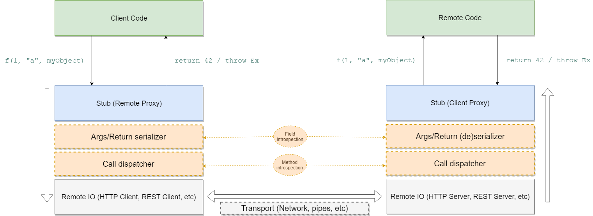

<!-- $theme: default -->
<!-- footer: manuel@by.com.es - www.by.com.es - "JSON RPC with C++ static reflection" Madrid C/C++ User Group Feb 2019-->

JSON RPC
========

with C++ static reflection

---

RPC?
====

 - *"Remote Procedure Call"*
 - Transparent invocation of remote APIs
 - Just a *call* to a function

---

RPC key concepts
================

 - Client vs Server / Sender vs Receiver
 - Call serialization scheme
 - Call routing / dispatching

---
RPC key concepts
================



---

RPC examples
============

 - SOAP
 - gRPC (Google RPC)
 - Qt Remote Objects
 - **JSON-RPC**

---


(Simple) JSON-RPC
=================

 - Function name as TCP/REST endpoint route
 - Call args encoded as JSON object **with ordered array of args**
 - Result encoded as JSON object with result/error field

---

JSON-RPC server
===============

 - Pistache (http://pistache.io/)
 - Both TCP/REST client and **server** available
 - Support for async request processing
 - Fast, easy to use

---

Pistache REST server
====================

``` cpp
Pistache::Http::Endpoint endpoint{"127.0.0.1"};
Pistache::Rest::Router router;

// Fill routes here...

endpoint.setHandler(router.handler());
endpoint.serve(); // Tah dah!
```

---

Pistache REST routes
====================

``` cpp
using namespace Pistache::Rest;

Routes::Post(router, "/method1",
    Routes::bind(&Class::method1, &classInstance))
```

---

(Automagic) Pistache REST routes
================================

``` cpp
tinyrefl::visit_member_functions<Class>([&obj](
    const std::string& name,
    const auto method) {
  Routes::Post("/" + name, Routes::bind(method, &obj));   
}
```

---

Well...
=======

 - Pistache route callbacks have a fixed signature

``` cpp
void myRouteHandler(
  const Pistache::Http::Request& req,
  Pistache::Http::ResponseWriter& res) {
    res.write(Pistache::Http::Ok);  
}
```

---

(Automagic) Pistache REST routes, again
=======================================

``` cpp
tinyrefl::visit_member_functions<Class>([&obj](
    const std::string& name,
    const auto method) {
    
  Routes::Post("/" + name, [&obj, method](
    const Request& req,
    ResponseWriter& res) {
      handleCall(obj, method, req, res);
    });   
}
```

---

``` cpp
template<typename Class, typename Method>
void handleCall(
    Class& obj,
    const Method method,
    const Request& req,
    ResponseWriter& res) {
    
  auto call = [&obj](auto&&... args) {
    return (obj.*method)(args...);
  }
 
  auto tuple_of_args = deserialize_call_args(
    method, req.body());
   
  try {
    const auto result = std::apply(call, tuple_of_args);
    res.body().write(serialize(result));
  } catch(const std::exception& ex) {
    res.body().write(
      fmt::format("{{\"error\": \"{}\"}}", ex.what())); 
  }
}
```

---

``` cpp
template<typename R, typename Class, typename... Args>
auto deserialize_call_args(
    R(Class::*method)(Args...),
    const std::string& body) {\

  const auto json_body = nlohmann::json::parse(body);
  
  std::tuple<std::decay_t<Args>...> args;
  
  tinyrefl::meta::foreach<std::decay_t<Args>...>(
    [&](auto type, auto index) {
      using Type = typename decltype(type)::type;
      using Index = decltype(index);
    
      std::get<Index::value>(args) = 
        json_body["args"][Index::value].get<Type>();
  });
  
  return args;
}
```

---

QA?
===

 - https://github.com/Manu343726/tinyrefl
 - https://github.com/Manu343726/madridccppug_json_rpc
 - https://github.com/madridccppug/meetups
 - ["Que es el movimiento de semantica?"](https://www.google.com/search?q=movimiento+de+semantica&oq=movimiento+de+semantica&aqs=chrome..69i57.3718j0j7&sourceid=chrome&ie=UTF-8)
